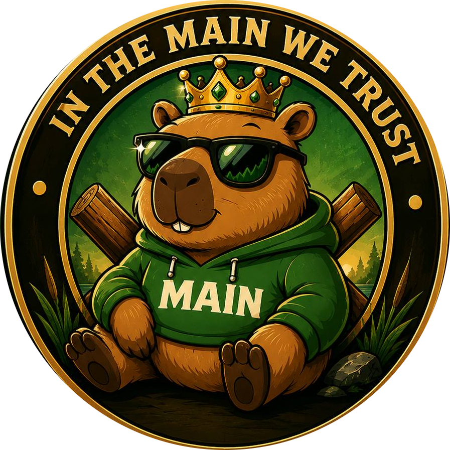

# <p align="center"><br>MAINEY ($MAIN)</p>

<p align="center">
  <strong>The Most Chill Capybara on the Solana Blockchain</strong>
</p>

<p align="center">
  <a href="https://t.me/+VCIatTbYnQthYjdk"></a>
  <a href="https://x.com/MAINEYTHECAPY"></a>
  <a href="https://github.com/ayanmal1k/MAINEY-TOKEN"></a>
</p>

---

## 🍃 Overview

Welcome to **MAINEY ($MAIN)**, the home of the most relaxed, chill capybara on Solana. Crafted as a high-fidelity interactive digital experience using **Next.js 16**, **Tailwind CSS**, **Framer Motion**, and **GSAP**, this site brings the ultimate capy vibes to web3. We are building a movement focused on community, relaxing vibes, and pure holding. 

<p align="center">
  
</p>

---

## 📊 Tokenomics ($MAIN)

Designed for absolute safety, fair distribution, and maximum chillness.

| Property | Value / Detail |
|---|---|
| **Token Name** | MAINEY THE CAPYBARA |
| **Token Symbol** | `$MAIN` |
| **Network** | Solana |
| **Total Supply** | `1,000,000,000` (1 Billion) |
| **Buy / Sell Tax** | `0%` |
| **Liquidity Pool** | `100% Locked` |
| **Launch Type** | Fair Launch (No Presale) |

---

## 🌟 Key Features

* **🛡️ Fair Launch**: No tokens were held back for presales, ensuring the community got equal footing.
* **🔒 100% Locked LP**: Maximum security for all capybaras in the pond.
* **💸 Zero Taxes**: 0% buy tax and 0% sell tax forever.
* **⚡ Solana Network**: Super fast transactions and low fees.
* **✨ Premium UI/UX**: Rich aesthetics featuring custom loading screens, magnetic button micro-interactions, smooth scrolling, and dynamic web animations.

---

## 🗺️ Roadmap

* **Phase 1: Pond Launch**
  - Telegram & X Launch
  - Website Release & Dynamic UI Optimization
  - Smart Contract Deployment
  - 100% Liquidity Locking
* **Phase 2: Chill Growth**
  - Community Spaces & AMAs
  - CoinGecko & CoinMarketCap Listings
  - Initial Marketing Push & Leaf-Stashing Campaign
* **Phase 3: Capy Takeover**
  - Exclusive Merch Drops
  - Mainey Web3 Integrations
  - Worldwide Capybara Vibe Cultination

---

## 🛠️ Local Development Setup

To run the premium digital experience on your local machine, follow these steps:

### Prerequisites
Make sure you have **Node.js** (v18+) and **npm** installed.

### 1. Clone the Repository
```bash
git clone https://github.com/ayanmal1k/MAINEY-TOKEN.git
cd MAINEY-TOKEN
```

### 2. Install Dependencies
```bash
npm install
```

### 3. Run Development Server
```bash
npm run dev
```
Open [http://localhost:3000](http://localhost:3000) (or the port specified in terminal) in your browser to view the application.

### 4. Build for Production
```bash
npm run build
npm start
```

---

## 🤝 Community & Links

- **Telegram**: [Join the Community Group](https://t.me/+VCIatTbYnQthYjdk)
- **X (Twitter)**: [Follow @MAINEYTHECAPY](https://x.com/MAINEYTHECAPY)
- **Raydium**: [Buy $MAIN on Raydium](https://raydium.io)
- **GitHub**: [MAINEY Repository](https://github.com/ayanmal1k/MAINEY-TOKEN)

<p align="center">
  
</p>
